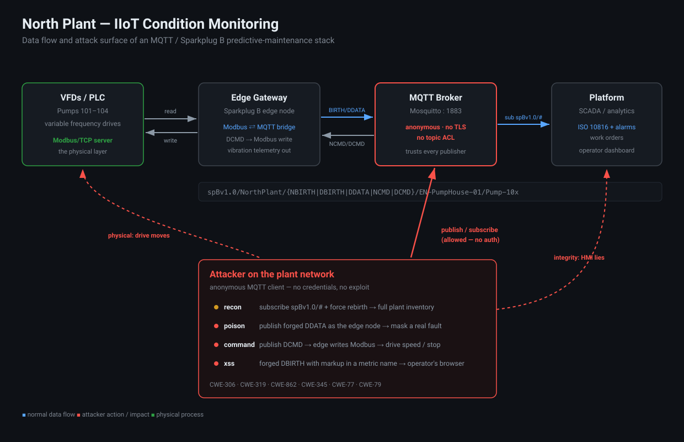
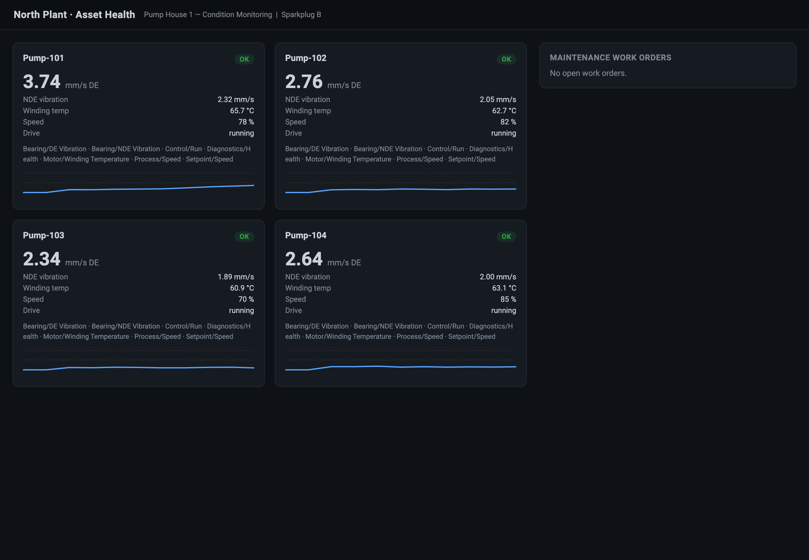
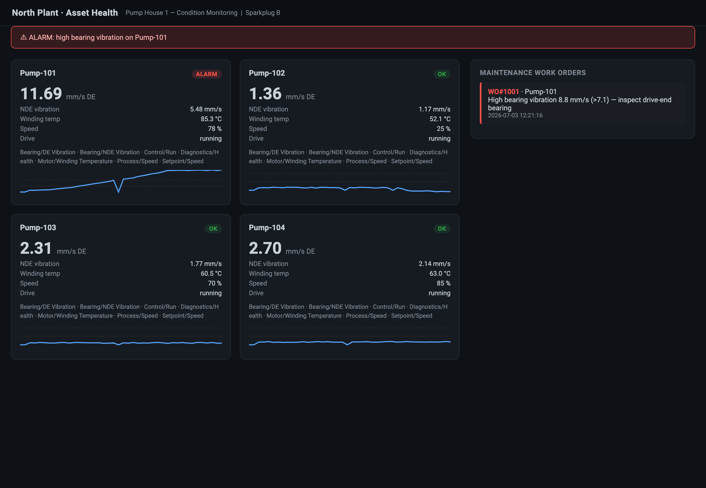
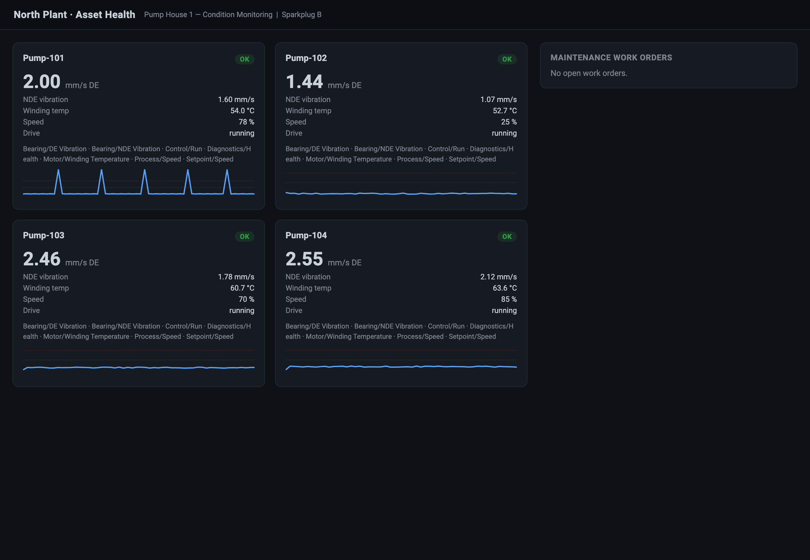
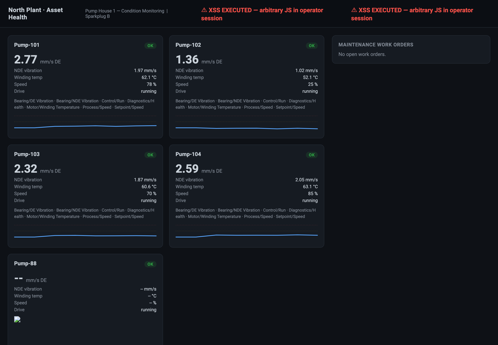

# North Plant — IIoT Condition Monitoring (vulnerable lab)

Lab code for the MQTT + Sparkplug B attack write-up. Deliberately broken —
open broker, no ACLs, injectable dashboard — but built to behave like the
real thing so the attacks are meaningful.

The scenario is a pump house with four VFD-driven pumps. An edge gateway
reads the sensors, talks Modbus to the drives, and publishes everything over
Sparkplug B to a Mosquitto broker. A platform subscribes, trends the
vibration, applies ISO 10816 limits, and opens maintenance work orders when a
bearing starts to go. Same pattern as Ignition + Cirrus Link, HiveMQ, EMQX,
AWS IoT SiteWise in real plants.

Note - A reminder that this is just for training and authorized testing only. The broker is intentionally open and the app is intentionally vulnerable. Do not expose it to any network you do not fully control.



## Architecture

```
  ┌────────────┐   Modbus/TCP    ┌────────────┐  Sparkplug B / MQTT  ┌────────────┐
  │  plc-sim   │◄───────────────►│ edge-node  │─────────────────────►│   broker   │
  │ (VFDs 101- │  read/write     │ (Sparkplug │   NBIRTH/DBIRTH      │ (Mosquitto │
  │  104)      │  registers      │  edge gw)  │   DDATA / NCMD/DCMD  │  anon,1883)│
  └────────────┘                 └────────────┘                      └─────┬──────┘
        physical layer            vibration model                          │ spBv1.0/#
                                  + command bridge                         ▼
                                                                    ┌────────────┐
                                                                    │  platform  │
                                                                    │ ingest +   │
                                                                    │ ISO 10816  │
                                                                    │ + dashboard│
                                                                    │ :8000      │
                                                                    └────────────┘
```

- **broker** — Mosquitto, `allow_anonymous true`, no TLS, no ACL.
- **plc-sim** — Modbus/TCP server, one slave per VFD (unit IDs 101–104).
- **edge-node** — Sparkplug B gateway. Publishes BIRTH certificates per pump,
  streams DDATA on aliases, maps writable metrics onto Modbus writes. Pump-101
  has a seeded bearing fault that grows over time.
- **platform** — subscribes `spBv1.0/#`, decodes protobuf, runs ISO 10816
  assessment, opens work orders, serves the dashboard.
- **attacker** — the toolkit (`recon`, `poison`, `command`, `spoof_birth_xss`).

## Run it (Docker + Make)

Note : For **Full command reference:** [`COMMANDS.md`](COMMANDS.md) — every build, run, attack, verify, screenshot, and teardown command for both Docker and local.

```bash
make up          # build + start the whole stack; dashboard on :8000
make demo        # narrated, timed walkthrough of the full attack chain
```

`make help` lists everything. The individual attacks:

```bash
make recon                       # harvest the plant inventory
make command PUMP=102 SPEED=20   # inject a speed setpoint (physical)
make stop-pump PUMP=101          # stop a drive
make poison                      # mask Pump-101's fault (Ctrl-C to stop)
make xss                         # stored XSS via forged BIRTH
make restart                     # reset the seeded fault + clear state
make down                        # tear it all down
```

Under the hood these are just `docker compose exec attacker python -m attacker.<tool>`,
so you can run them by hand too.

### The demo script

`./demo.sh` runs a four-act narrated walkthrough (recon → command injection →
fault-masking with a before/after control → XSS pivot), with pauses sized for a
screen recording. Open the dashboard next to your terminal before you start it.
It targets Docker by default; point it at any stack with `API`, `PLANT_PY` and
`RESET_STACK` env vars (see the top of the script).

## Run it (local, no Docker)

You need a broker. Any MQTT broker works (`mosquitto`, or `pip install amqtt`).
Python 3.11/3.12 recommended.

```bash
python -m venv .venv && . .venv/bin/activate
pip install -r requirements.txt

# terminal 1: a broker on :1883 (e.g. mosquitto -c broker/mosquitto.conf)
# terminal 2:
PLC_PORT=1502 python -m plc_sim.vfd
# terminal 3:
MQTT_HOST=127.0.0.1 PLC_PORT=1502 python -m edge_node.node
# terminal 4:
MQTT_HOST=127.0.0.1 python -m platform_app.app        # http://localhost:8000
# terminal 5 (attacks):
MQTT_HOST=127.0.0.1 python -m attacker.recon
```

## What it looks like

| Healthy | Real fault caught | Fault masked (attack) | XSS pivot |
|---|---|---|---|
|  |  |  |  |

## The attack chain

| Step | Tool | Effect |
|------|------|--------|
| Recon | `attacker.recon` | Anonymous connect, harvest full plant inventory from BIRTH certificates, list writable control points |
| Poison | `attacker.poison` | Impersonate the edge node, forge healthy DDATA, mask a developing bearing fault → no alarm, no work order |
| Command | `attacker.command` | DCMD to a writable metric → edge writes the real Modbus register → drive speed/stop changes |
| Pivot | `attacker.spoof_birth_xss` | Forged BIRTH with an XSS metric name → runs in the operator's browser |

## Tunables (env)

| Var | Default | Meaning |
|-----|---------|---------|
| `FAULT_DELAY` | 25 | seconds before the Pump-101 bearing fault starts |
| `FAULT_RAMP` | 240 | seconds for the fault to fully develop |
| `SAMPLE_INTERVAL` | 3 | edge publish interval (s) |
| `ALARM_SUSTAIN` | 6 | seconds a machine must stay over the alarm band before the alarm latches |

## Vulnerabilities (by design)

- **CWE-306 / CWE-319** — anonymous, plaintext broker.
- **CWE-862** — no topic ACLs; anyone can publish NCMD/DCMD.
- **CWE-345** — no message-level source authentication; edge nodes are spoofable.
- **CWE-77 / CWE-306** — writable metrics bridged straight to Modbus writes.
- **CWE-79** — dashboard renders BIRTH-supplied names as trusted markup.

Read the Blog, or LinkedIn/X Article, that brought you here, for the full write-up and remediation.
